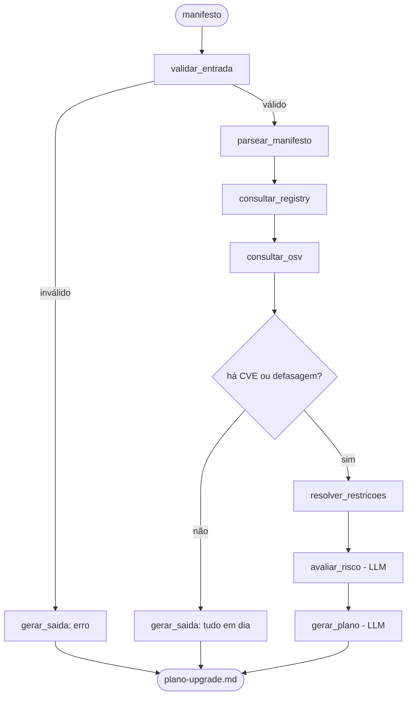

# Arquitetura — Planejador de Upgrade de Dependências

Agente em LangGraph que lê um manifesto de dependências (`requirements.txt` ou `package.json`), cruza registry + base de vulnerabilidades + resolução de restrições, e devolve um **plano de upgrade priorizado em ondas**.

| | |
|---|---|
| **Disciplina** | IA para Desenvolvedores [T1] — Mini-Projeto Avaliativo, Módulo 2 |
| **Formato** | Individual |
| **LLM** | Groq (`langchain-groq`) |
| **Entrega** | **20/07/2026** — o corpo do PDF diz 22h, o checklist final diz 15h. **Assumir 15h.** |
| **Peso** | 30% da nota do módulo (0 a 10 pts) |

---

## 1. Status da entrega

> **Regra deste documento: nada é entregue com item desmarcado.** Os 8 critérios abaixo somam os 10 pontos. Marcar conforme concluir e manter este bloco atualizado — ele é a fonte da verdade do que falta.

### 1.1. Critérios de avaliação (10,0 pts)

| ✔ | Nº | Critério | Pts | Artefato | Status |
|---|----|----------|-----|----------|--------|
| ☐ | 1 | Versionamento com branches e commits semânticos | 1,0 | histórico do repo | Branch por etapa + merge `--no-ff` + commits semânticos, em andamento desde 17/07 |
| ☐ | 2 | Contribuição individual e produtividade | 1,0 | commits ao longo dos dias | Em andamento — só avaliável no fim |
| ☐ | 3 | Organização dos arquivos, documentação e prompts | 2,0 | `README.md`, `docs/prompts.md`, `exemplos/` | README.md e prompts.md escritos; vai crescer com o código |
| ☐ | 4 | Ideia do projeto e apresentação | 1,0 | `docs/slides.md` | Ideia fechada; slides pendentes |
| ☐ | 5 | Implementação do agente com LangGraph | 1,0 | `src/agent.py` | Desenhado (seção 6); não implementado |
| ✔ | 6 | Uso de ferramenta integrada ao agente | 1,0 | `src/registries.py`, `vulns.py`, `resolver.py` | Implementadas e testadas contra API real; falta plugar no grafo (nº 5) |
| ✔ | 7 | Cuidados básicos de segurança | 1,0 | `.gitignore`, `.env.example` | `.env` e `*.pdf` no gitignore desde o 1º commit; nenhum segredo versionado |
| ☐ | 8 | Contexto, memória e validação básica | 2,0 | estado do grafo + Pydantic | Pydantic em todos os modelos de dados + validação de nome de pacote; falta o estado do grafo (`TypedDict`) |

**Onde a nota realmente está:** critérios 3 e 8 valem 2,0 cada. Documentação + validação = **4 dos 10 pontos**. "O agente funciona" (5 e 6) vale 2,0. Capriche no README e nas validações antes de sofisticar o agente.

### 1.2. Checklist final do enunciado (seção 7 do PDF)

**Repositório**
- [ ] Repositório criado no GitHub e acessível
- [ ] Contém o código-fonte do agente
- [ ] Histórico de commits compatível com o desenvolvimento realizado

**Agente**
- [x] Processo a automatizar definido → planejamento de upgrade de dependências
- [x] Objetivo, entrada e saída claramente definidos → seção 3
- [ ] Implementado com LangGraph
- [ ] Fluxo usa estado, nós e conexões
- [ ] Executa de forma funcional e gera saída estruturada

**Ferramentas, contexto e validação**
- [ ] Pelo menos uma ferramenta integrada *ao agente* (as ferramentas existem e funcionam isoladas — falta o grafo que as integra)
- [x] A ferramenta executa ação real (não simulada) — `registries.py` e `vulns.py` testados contra API real
- [ ] Usa contexto ou memória durante a execução (depende do estado do grafo, nº 5)
- [x] Validação básica de entrada, saída ou uso da ferramenta — Pydantic nos modelos + regex antes de montar URL
- [x] Nenhuma chave/token versionado

**README e prompts**
- [x] README apresenta problema, objetivo e funcionamento
- [x] README explica como executar (o que já roda hoje + o que falta)
- [x] README descreve o fluxo LangGraph e a ferramenta
- [ ] README traz exemplo de entrada e saída — entrada sim, saída pendente (depende de `src/agent.py`, não fabricar saída falsa)
- [x] Principais prompts registrados em `.md` → `docs/prompts.md` (atualizar até o fim)

**Apresentação**
- [ ] Até 2 slides com problema, agente, entrada, saída, ferramenta e fluxo
- [ ] Submetida via AVA ou versionada no repositório

**Submissão**
- [ ] Link do repositório submetido no AVA
- [ ] Link testado antes de submeter
- [ ] Entregue antes de **20/07/2026, 15h**
- [ ] Não modificar o repositório após a entrega

---

## 2. O problema

Manter dependências é sempre adiado até virar incidente. As ferramentas existentes respondem perguntas isoladas: `pip list --outdated` diz o que está velho, `pip-audit` diz o que é vulnerável. Nenhuma responde a pergunta que o dev realmente tem:

> **"Por onde eu começo, o que dá pra subir sem quebrar nada, e o que vai me dar trabalho?"**

Isso não é lookup — é priorização sobre um grafo de restrições, com julgamento de risco. É onde um agente ganha de um comando.

---

## 3. O agente

| | |
|---|---|
| **Objetivo** | Transformar um manifesto de dependências em um plano de upgrade priorizado, executável PR a PR. |
| **Entrada** | Caminho de um `requirements.txt` ou `package.json`. O ecossistema é detectado pelo arquivo. |
| **Saída** | `saidas/plano-upgrade.md` — plano em ondas (seção 9) + resumo no stdout. |

**Etapas principais**

1. Valida o manifesto e detecta o ecossistema
2. Parseia as dependências declaradas e suas restrições
3. Consulta o registry (versões reais, datas, restrições de cada versão)
4. Consulta CVEs no OSV.dev
5. Resolve: maior versão viável por dependência + agrupa as que precisam se mover juntas
6. LLM classifica o risco de cada upgrade e ordena as ondas
7. Escreve o plano

**Por que é um agente e não um script:** o fluxo decide em tempo de execução. Se o parse falhar, nem consulta rede. Se não houver vulnerabilidade nem defasagem, encerra sem gastar LLM. Se houver conflito, entra o resolvedor. A aresta condicional depende do resultado da ferramenta anterior — é controle de fluxo com tomada de decisão, exatamente o que o critério 5 pede.

**Por que não é "coisa que o Copilot já faz":**

- **O LLM não sabe a versão atual de nada.** O knowledge cutoff garante isso. Todo fato vem de API; o modelo só julga.
- **Resolução de versão é satisfação de restrições.** O resolvedor do pip é um SAT solver. LLM não faz isso de forma confiável — chuta.

**Honestidade obrigatória no README:** `pip-audit` e `pip list --outdated` existem e fazem parte do trabalho. O diferencial aqui é *cruzar* as fontes e produzir um plano agrupado e priorizado com julgamento de risco. Declarar isso nas limitações vale mais que fingir ineditismo — e um avaliador que conhece as ferramentas vai reparar de qualquer jeito.

---

## 4. Stack e fontes de dados

| Item | Escolha |
|------|---------|
| Linguagem | Python 3.13 |
| Orquestração | `langgraph` |
| LLM | `langchain-groq` (`GROQ_API_KEY`) |
| Validação | `pydantic` |
| Config | `python-dotenv` |
| HTTP | `httpx` (ou `urllib.request` da stdlib, se quiser zero dependência) |
| Versões PEP 440 | `packaging` |
| Versões semver (npm) | parser próprio de `^`/`~` — **avaliar antes de adicionar dependência** |

### Fontes verificadas em 17/07/2026 — todas públicas, sem token

| Fonte | Endpoint | O que dá |
|-------|----------|----------|
| **PyPI** | `GET https://pypi.org/pypi/{pkg}/{versão}/json` | `requires_dist` (ex.: `"urllib3 (<1.27,>=1.21.1)"`), `upload_time` |
| **npm** | `GET https://registry.npmjs.org/{pkg}/{versão}` | `dependencies` com ranges (ex.: `"etag":"~1.8.1"`), `peerDependencies` |
| **OSV.dev** | `POST https://api.osv.dev/v1/query` | Body: `{"package":{"name":..,"ecosystem":"PyPI"\|"npm"},"version":..}` → `{"vulns":[...]}` |

`PyPI` e `npm` são ambos ecossistemas válidos do OSV, com a **mesma** query — é isso que torna o suporte aos dois manifestos barato. (`GET` no OSV devolve 405: o endpoint existe, só exige POST.)

### A assimetria pip × npm — declarar no README

- **pip é flat**: uma única versão de cada pacote no ambiente. Conflito real existe: subir `pydantic` obriga a subir `fastapi` junto.
- **npm aninha `node_modules`**: cada pacote carrega sua própria cópia. Conflito quase não existe — só em `peerDependencies`.

Consequência: o núcleo de resolução de restrições brilha no lado Python. No lado Node, o valor entregue é CVE, defasagem e peer deps. **Não fingir simetria** — declarar a diferença é mais forte que escondê-la.

---

## 5. Estrutura de pastas

```
.env.example          # GROQ_API_KEY=        (só o nome, sem valor)
.gitignore            # .env, __pycache__/, saidas/
README.md             # critério 3 — escrever na etapa 6
ARQUITETURA.md        # este arquivo
requirements.txt
src/
  agent.py            # StateGraph: estado, nós, arestas, compile()
  parsers.py          # requirements.txt | package.json -> modelo normalizado
  registries.py       # cliente PyPI + cliente npm
  vulns.py            # cliente OSV.dev
  resolver.py         # núcleo determinístico de restrições
  prompts.py          # prompts do LLM, isolados do fluxo
  main.py             # CLI: python src/main.py exemplos/requirements.txt
docs/
  prompts.md          # prompts do desenvolvimento (critério 3)
  slides.md           # 2 slides (critério 4)
exemplos/
  requirements.txt    # deliberadamente bagunçado (fastapi 0.85 + pydantic 1.x)
  package.json
  plano-upgrade.md    # saída real, gerada pela execução
tests/
  test_agent.py       # entrada malformada + resolução de conflito
```

O `exemplos/requirements.txt` **precisa** ter conflito de verdade — num projeto limpo o resolvedor não tem o que mostrar e o plano degenera numa lista.

---

## 6. Arquitetura do agente



| Nó | Responsabilidade | LLM? |
|----|------------------|------|
| `validar_entrada` | Arquivo existe, formato reconhecido, não vazio, tamanho sane | Não |
| `parsear_manifesto` | `requirements.txt`/`package.json` → modelo normalizado | Não |
| `consultar_registry` | **Ferramenta**: PyPI/npm — versões, datas, restrições | Não |
| `consultar_osv` | **Ferramenta**: OSV.dev — CVEs por pacote+versão | Não |
| `resolver_restricoes` | **Ferramenta**: maior versão viável + grupos de co-movimento | Não |
| `avaliar_risco` | Classifica risco de quebra por salto de versão | Sim |
| `gerar_plano` | Ordena ondas e escreve a narrativa | Sim |

**A aresta condicional (`há CVE ou defasagem?`) é o coração do critério 5.** O rubric exige "StateGraph para o controle de fluxo **e tomada de decisão**" — um grafo linear atende só parcialmente. Aqui a decisão é real: sem achado, o agente encerra sem chamar o LLM.

Separação exigida pelo enunciado (planejar / executar / usar ferramenta / responder): parse e validação preparam, os três nós de ferramenta executam, `avaliar_risco` julga, `gerar_plano` responde. Um nó, um papel.

---

## 7. Estado compartilhado

O contexto/memória do critério 8 (2,0 pts) é o próprio estado do grafo:

```python
class EstadoUpgrade(TypedDict):
    caminho: str                      # manifesto de entrada
    ecossistema: Literal["PyPI", "npm"]
    dependencias: list[Dependencia]   # declaradas: nome + restrição
    versoes: dict[str, list[Versao]]  # do registry: versão, data, requires
    vulns: dict[str, list[Vuln]]      # do OSV
    plano: list[Upgrade] | None       # do resolvedor: de, para, move_junto
    riscos: dict[str, Risco]          # do LLM
    saida: str | None
    erros: list[str]
```

Cada nó devolve **só as chaves que mudou** — o LangGraph faz o merge. Não criar "gerenciador de memória": o estado do grafo já é a memória da execução.

O estado também serve de **cache dentro da execução**: `versoes` é consultado uma vez e reusado pelo resolvedor e pelo avaliador de risco, sem rechamar a API. Isso é uso real de contexto, e vale citar no README.

---

## 8. Validação (critério 8 — 2,0 pts)

| Onde | O quê |
|------|-------|
| **Entrada** | Arquivo existe, extensão/nome reconhecido, não vazio, tamanho máximo, parseável |
| **Manifesto** | Linha malformada não derruba a execução — vai para `erros` e o resto segue |
| **Resposta da API** | Schema Pydantic no retorno de PyPI/npm/OSV — API pode mudar ou devolver 404/429 |
| **Saída do LLM** | `llm.with_structured_output(Risco)` — se não devolver o schema, cai em `erros` |
| **Ferramenta** | Nome de pacote validado contra regex antes de virar URL (**nunca** interpolar entrada crua em URL) |

Casos para `tests/test_agent.py`: manifesto vazio, linha malformada, pacote inexistente (404), e um conflito real (o resolvedor precisa detectar que `fastapi<0.100` impede `pydantic>=2`). Dois ou três testes bastam — não é para montar suíte.

---

## 9. Formato da saída

```markdown
# Plano de Upgrade — requirements.txt (PyPI)
> 14 dependências diretas · 3 vulneráveis · 8 desatualizadas · gerado em 2026-07-17

## Resumo
| Vulneráveis | Seguras p/ subir | Exigem trabalho | Bloqueadas |
|-------------|------------------|-----------------|------------|
| 3           | 5                | 3               | 1          |

## Onda 1 — Urgente
### requests 2.28.1 → 2.32.4   [minor · risco baixo]
Por quê:     GHSA-9hjg-9r4m-mvj7, vazamento de credenciais .netrc via URL maliciosa  [OSV]
Compatível:  satisfaz urllib3<1.27 que você fixou                        [PyPI]
Risco:       salto minor, sem remoção de API pública                     [LLM]

## Onda 2 — Seguro (patch/minor, sem CVE)
| pacote | de | para | salto |
|--------|-----|------|-------|

## Onda 3 — Exige trabalho
### pydantic 1.10.2 → 2.9.0   [MAJOR · risco alto]
Move junto:  fastapi 0.85.0 → 0.115.0 (fastapi<0.100 exige pydantic<2)   [PyPI]
Risco:       validators v1 removidos na v2                               [LLM]

## Bloqueados
- boto3: existe 1.35, mas seu botocore==1.29 fixado impede
```

**A etiqueta de procedência é decisão de design, não enfeite.** Todo fato vem de `[PyPI]`/`[npm]`/`[OSV]`; só o julgamento é `[LLM]`. Isso:

- atende o "geração de saídas verificáveis" que o enunciado pede;
- deixa a divisão LLM/ferramenta visível no próprio artefato — ótimo para os 2 slides;
- permite conferir qualquer linha do plano sem confiar no modelo.

O LLM **nunca** inventa número de CVE nem versão: esses campos vêm do estado, não da geração.

---

## 10. Segurança (critério 7 — 1,0 pt)

- `GROQ_API_KEY` **apenas** via `.env` + `python-dotenv`. Nunca no código, nunca em log, nunca na saída.
- `.env` no `.gitignore` **antes do primeiro commit**. Chave commitada uma vez fica no histórico para sempre — se acontecer, revogar na Groq, não só remover o arquivo.
- `.env.example` versionado só com `GROQ_API_KEY=` — nome, sem valor.
- **Nome de pacote nunca interpolado cru em URL.** Validar contra regex antes: é entrada de usuário virando request.
- Timeout e limite de tamanho em toda chamada HTTP.
- Sem `eval`, sem `subprocess`, sem instalar nada — o agente **lê e planeja, não executa upgrade**.
- Se usar um manifesto real de trabalho como exemplo, conferir que não há pacote privado/URL interna antes de versionar.

---

## 11. Fluxo de trabalho no Git (critério 1 — 1,0 pt)

Projeto individual não exige PR, mas o rubric exige "commits claros, incrementais e alinhados ao padrão de commits semânticos" e branches.

```
chore/setup              → .gitignore, .env.example, requirements.txt
feat/parser-requirements → parsers.py (PyPI)
feat/registry-pypi       → registries.py
feat/osv                 → vulns.py
feat/resolver            → resolver.py
feat/grafo               → agent.py + main.py
feat/parser-package-json → suporte npm
feat/validacao           → Pydantic + tests/
docs/readme-e-prompts    → README.md + docs/prompts.md
docs/slides              → docs/slides.md
```

- Commits semânticos: `feat:`, `fix:`, `docs:`, `test:`, `chore:`, `refactor:`
- Commits pequenos ao longo dos dias. **Um único commit "projeto pronto" zera o critério 2**, que avalia produtividade rastreável.
- `.gitignore` no primeiro commit, antes de existir qualquer `.env`.

---

## 12. Cronograma (3 dias — 17 a 20/07)

| # | Etapa | Entrega | ✔ |
|---|-------|---------|---|
| 0 | Arquitetura | `ARQUITETURA.md` | [x] |
| 1 | `chore/setup` | Repo, `.gitignore`, `.env.example`, `requirements.txt` | [ ] |
| 2 | `feat/parser-requirements` | Parse do `requirements.txt` → modelo normalizado | [ ] |
| 3 | `feat/registry-pypi` + `feat/osv` | As duas ferramentas de consulta funcionando | [ ] |
| 4 | `feat/resolver` | Núcleo de restrições + grupos de co-movimento | [ ] |
| 5 | `feat/grafo` | StateGraph ligando tudo, rodando ponta a ponta | [ ] |
| 6 | `feat/parser-package-json` | Suporte a npm | [ ] |
| 7 | `feat/validacao` | Pydantic + `tests/test_agent.py` | [ ] |
| 8 | `docs/readme-e-prompts` | README completo + prompts.md | [ ] |
| 9 | `docs/slides` | 2 slides | [ ] |
| 10 | Submissão | Testar link, submeter no AVA, **não mexer mais** | [ ] |

**Ordem pensada para o prazo:** o suporte a npm (etapa 6) vem depois do fluxo Python completo. Se o tempo apertar, **npm é o primeiro a cair** — vira limitação declarada no README, não entrega quebrada. As etapas 8 e 9 valem 3,0 pts: não deixe para a última hora.

---

## 13. Limitações a declarar no README

- **Só o manifesto, não o código.** O agente julga risco por salto de versão e release notes; não lê seu código para dizer o que vai quebrar de fato.
- **Só dependências diretas declaradas.** Não monta a árvore transitiva completa.
- **npm assimétrico** (ver seção 4): resolução de conflito é fraca por natureza do `node_modules` aninhado.
- **Ferramentas existentes**: `pip-audit`/`pip list --outdated` cobrem partes disso; o diferencial é o cruzamento e a priorização.
- **Saída depende do LLM** na parte de risco — os fatos são determinísticos, a narrativa varia entre execuções.
- **Sem persistência entre execuções.** Se virar requisito, `MemorySaver` do LangGraph resolve sem código novo.
