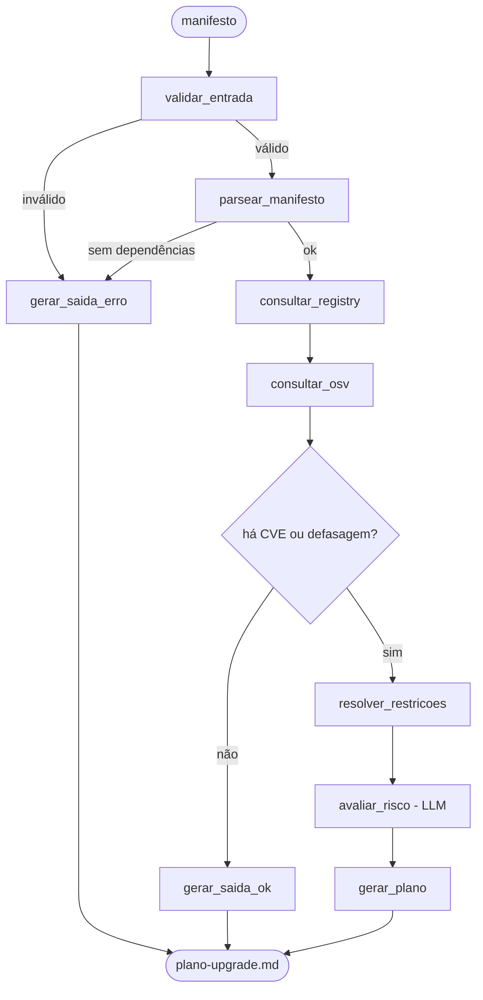

# Arquitetura — Planejador de Upgrade de Dependências

Agente em LangGraph que lê um manifesto de dependências (`requirements.txt` ou `package.json`), cruza registry + base de vulnerabilidades + resolução de restrições, e devolve um **plano de upgrade priorizado em ondas**.

| | |
|---|---|
| **Disciplina** | IA para Desenvolvedores [T1] — Mini-Projeto Avaliativo, Módulo 2 |
| **Formato** | Individual |
| **LLM** | Groq (`langchain-groq`) |

---

## 1. Status do projeto

**Repositório**
- [x] Repositório no GitHub, organizado e acessível → https://github.com/AirtonD/upgrade-planner
- [x] Contém o código-fonte do agente
- [x] Histórico de commits compatível com o desenvolvimento realizado — branch por etapa, merge `--no-ff`

**Agente**
- [x] Processo a automatizar definido → planejamento de upgrade de dependências
- [x] Objetivo, entrada e saída claramente definidos → seção 3
- [x] Implementado com LangGraph
- [x] Fluxo usa estado, nós e conexões
- [x] Executa de forma funcional e gera saída estruturada — rodado contra `exemplos/requirements.txt` de verdade

**Ferramentas, contexto e validação**
- [x] Pelo menos uma ferramenta integrada ao agente — 3 ferramentas (`registries`, `vulns`, `resolver`) plugadas no grafo
- [x] A ferramenta executa ação real (não simulada) — testado contra PyPI e OSV.dev reais
- [x] Usa contexto ou memória durante a execução — `EstadoUpgrade` carrega dados entre todos os nós
- [x] Validação básica de entrada, saída ou uso da ferramenta — Pydantic nos modelos + regex antes de montar URL + tamanho máximo de arquivo
- [x] Nenhuma chave/token versionado

**README e prompts**
- [x] README apresenta problema, objetivo e funcionamento
- [x] README explica como executar
- [x] README descreve o fluxo LangGraph e a ferramenta
- [x] README traz exemplo de entrada e saída — saída real, gerada por uma execução de verdade, não fabricada
- [x] Principais prompts registrados em `.md` → `docs/prompts.md`

**Apresentação**
- [x] Até 2 slides com problema, agente, entrada, saída, ferramenta e fluxo → `docs/slides.md`

---

## 2. O problema

Manter dependências é sempre adiado até virar incidente. As ferramentas existentes respondem perguntas isoladas: `pip list --outdated` diz o que está velho, `pip-audit` diz o que é vulnerável. Nenhuma responde a pergunta que o dev realmente tem:

> **"Por onde eu começo, o que dá pra subir sem quebrar nada, e o que vai me dar trabalho?"**

Isso não é lookup — é priorização sobre um grafo de restrições, com julgamento de risco. É onde um agente ganha de um comando.

---

## 3. O agente

| | |
|---|---|
| **Objetivo** | Transformar um manifesto de dependências em um plano de upgrade priorizado, executável PR a PR. |
| **Entrada** | Caminho de um `requirements.txt` ou `package.json`. O ecossistema é detectado pelo arquivo. |
| **Saída** | `saidas/plano-upgrade.md` — plano em ondas (seção 9) + resumo no stdout. |

**Etapas principais**

1. Valida o manifesto e detecta o ecossistema
2. Parseia as dependências declaradas e suas restrições
3. Consulta o registry (versões reais, datas, restrições de cada versão)
4. Consulta CVEs no OSV.dev
5. Resolve: maior versão viável por dependência + agrupa as que precisam se mover juntas
6. LLM classifica o risco de cada upgrade e ordena as ondas
7. Escreve o plano

**Por que é um agente e não um script:** o fluxo decide em tempo de execução. Se o parse falhar, nem consulta rede. Se não houver vulnerabilidade nem defasagem, encerra sem gastar LLM. Se houver conflito, entra o resolvedor. A aresta condicional depende do resultado da ferramenta anterior — é controle de fluxo com tomada de decisão real, não um pipeline linear disfarçado de grafo.

**Por que não é "coisa que o Copilot já faz":**

- **O LLM não sabe a versão atual de nada.** O knowledge cutoff garante isso. Todo fato vem de API; o modelo só julga.
- **Resolução de versão é satisfação de restrições.** O resolvedor do pip é um SAT solver. LLM não faz isso de forma confiável — chuta.

**Honestidade obrigatória no README:** `pip-audit` e `pip list --outdated` existem e fazem parte do trabalho. O diferencial aqui é *cruzar* as fontes e produzir um plano agrupado e priorizado com julgamento de risco. Declarar isso nas limitações vale mais que fingir ineditismo — e um avaliador que conhece as ferramentas vai reparar de qualquer jeito.

---

## 4. Stack e fontes de dados

| Item | Escolha |
|------|---------|
| Linguagem | Python 3.13 |
| Orquestração | `langgraph` |
| LLM | `langchain-groq` (`GROQ_API_KEY`) |
| Validação | `pydantic` |
| Config | `python-dotenv` |
| HTTP | `httpx` |
| Versões PEP 440 | `packaging` |
| Versões semver (npm) | parser próprio de `^`/`~`/exata/comparadores em `registries.satisfaz_range_npm` — subconjunto deliberado, não motor semver completo (ver seção 13) |

### Fontes usadas — todas públicas, sem token

| Fonte | Endpoint | O que dá |
|-------|----------|----------|
| **PyPI** | `GET .../pypi/{pkg}/json` | Todas as versões publicadas (`releases`) |
| **PyPI** | `GET .../pypi/{pkg}/{versão}/json` | `requires_dist` (ex.: `"urllib3<1.27,>=1.21.1"`) e `upload_time` de UMA versão — nota: este endpoint traz a chave `urls`, não `releases` (achado durante a implementação, ver `docs/prompts.md`) |
| **npm** | `GET registry.npmjs.org/{pkg}` | Todas as versões (`versions`), cada uma já com `dependencies` embutido — não precisa de uma segunda chamada por versão como o PyPI |
| **npm** | `GET registry.npmjs.org/{pkg}/{versão}` | Manifesto de uma versão específica |
| **OSV.dev** | `POST api.osv.dev/v1/query` | Body: `{"package":{"name":..,"ecosystem":"PyPI"\|"npm"},"version":..}` → `{"vulns":[...]}` |

`PyPI` e `npm` são ambos ecossistemas válidos do OSV, com a **mesma** query — é isso que torna o suporte aos dois manifestos barato. (`GET` no OSV devolve 405: o endpoint existe, só exige POST.)

### A assimetria pip × npm — declarar no README

- **pip é flat**: uma única versão de cada pacote no ambiente. Conflito real existe: subir `pydantic` obriga a subir `fastapi` junto.
- **npm aninha `node_modules`**: cada pacote carrega sua própria cópia. Conflito quase não existe — só em `peerDependencies`.

Consequência: o núcleo de resolução de restrições brilha no lado Python. No lado Node, o valor entregue é CVE, defasagem e peer deps. **Não fingir simetria** — declarar a diferença é mais forte que escondê-la.

---

## 5. Estrutura de pastas

```
.env.example          # GROQ_API_KEY=        (só o nome, sem valor)
.gitignore            # .env, *.pdf, __pycache__/, saidas/
README.md             # escrito incrementalmente ao longo do desenvolvimento, não só no fim
ARQUITETURA.md        # este arquivo
requirements.txt
src/
  agent.py            # StateGraph: estado, nós, arestas, compile()
  parsers.py          # requirements.txt | package.json -> modelo normalizado
  registries.py       # cliente PyPI + cliente npm
  vulns.py            # cliente OSV.dev
  resolver.py         # núcleo determinístico de restrições (só PyPI, ver seção 13)
  prompts.py          # prompts do LLM, isolados do fluxo
  main.py             # CLI: python -m src.main exemplos/requirements.txt
docs/
  prompts.md          # prompts do desenvolvimento
  slides.md           # 2 slides
exemplos/
  requirements.txt    # deliberadamente bagunçado (fastapi 0.85 + pydantic 1.x)
  package.json        # manifesto npm de exemplo
  plano-upgrade.md    # saída real (PyPI), gerada pela execução
  plano-upgrade-npm.md # saída real (npm)
tests/
  test_agent.py       # manifesto vazio, linha malformada, 404, conflito real
```

O `exemplos/requirements.txt` **precisa** ter conflito de verdade — num projeto limpo o resolvedor não tem o que mostrar e o plano degenera numa lista.

---

## 6. Arquitetura do agente



| Nó | Responsabilidade | LLM? |
|----|------------------|------|
| `validar_entrada` | Arquivo existe, formato reconhecido, não vazio, tamanho sane | Não |
| `parsear_manifesto` | `requirements.txt`/`package.json` → modelo normalizado | Não |
| `consultar_registry` | **Ferramenta**: PyPI/npm — versões, datas, restrições. Calcula a versão "efetiva" a partir da restrição do manifesto (`==`, `>=`, `~=` ou sem restrição), não só pin exato | Não |
| `consultar_osv` | **Ferramenta**: OSV.dev — CVEs por pacote+versão | Não |
| `resolver_restricoes` | **Ferramenta**: maior versão viável + grupos de co-movimento | Não |
| `avaliar_risco` | Classifica risco de quebra por salto de versão | Sim |
| `gerar_plano` | Ordena ondas e escreve a narrativa | **Não** — ver abaixo |

**Duas arestas condicionais, não uma.** Além de "há CVE ou defasagem?", `validar_entrada` e `parsear_manifesto` também podem encerrar cedo (arquivo ausente/vazio/grande demais, ou nenhuma dependência reconhecível) — evita gastar rede e LLM em entrada inválida.

**A aresta condicional depois de `consultar_osv` é o ponto central do design.** Um `StateGraph` só se justifica se controla fluxo **e** toma decisão — um grafo linear seria só um pipeline disfarçado. Aqui a decisão é real: sem achado, o agente encerra sem chamar o LLM.

**Correção de rota: `gerar_plano` não usa o LLM**, ao contrário do desenho original desta seção. É um template determinístico em Python que monta o markdown a partir do estado (`resolucao`, `vulnerabilidades`, `riscos`) — só a linha `Risco:` de cada item vem do `avaliar_risco`. Um segundo LLM call reescrevendo o plano inteiro arriscaria alucinar um fato (versão, CVE) que o estado já tinha correto; a etiqueta de procedência da seção 9 só funciona se `[PyPI]`/`[OSV]` vierem literalmente do estado, nunca de geração de texto.

Separação exigida pelo enunciado (planejar / executar / usar ferramenta / responder): parse e validação preparam, os três nós de ferramenta executam, `avaliar_risco` julga, `gerar_plano` responde. Um nó, um papel.

---

## 7. Estado compartilhado

O contexto/memória do agente é o próprio estado do grafo. Schema real (`src/agent.py`):

```python
class EstadoUpgrade(TypedDict, total=False):
    caminho: str                                  # manifesto de entrada
    ecossistema: Ecossistema                      # "PyPI" | "npm"
    dependencias: list[Dependencia]                # declaradas: nome + restrição
    versoes_atuais: dict[str, VersaoPacote]         # versão efetiva de cada dep, com requires_dist
    infos: dict[str, InfoPacote]                     # todas as versões publicadas + a última
    vulnerabilidades: dict[str, list[Vulnerabilidade]] # do OSV, só quem tem achado
    resolucao: ResultadoResolucao                      # grupos, bloqueios, sem_mudanca
    riscos: dict[str, RiscoItem]                        # do LLM
    saida_md: str
    erros: Annotated[list[str], operator.add]            # reducer: cada nó soma, ninguém sobrescreve
```

Cada nó devolve **só as chaves que mudou** — o LangGraph faz o merge. `erros` é a exceção: três nós diferentes (`validar_entrada`, `parsear_manifesto`, `consultar_registry`) podem reportar erro na mesma execução, então o campo usa `Annotated[list[str], operator.add]` — sem isso, o segundo nó que escrevesse `erros` apagaria o do primeiro. Não criar "gerenciador de memória": o estado do grafo já é a memória da execução.

O estado também serve de **cache dentro da execução**: `infos`/`versoes_atuais` são consultados uma vez em `consultar_registry` e reusados por `resolver_restricoes` e `gerar_plano`, sem rechamar a API. Isso é uso real de contexto, e está citado no README.

---

## 8. Validação

| Onde | O quê |
|------|-------|
| **Entrada** | Arquivo existe, extensão/nome reconhecido, não vazio, tamanho máximo, parseável |
| **Manifesto** | Linha malformada não derruba a execução — vai para `erros` e o resto segue |
| **Resposta da API** | Schema Pydantic no retorno de PyPI/npm/OSV — API pode mudar ou devolver 404/429 |
| **Saída do LLM** | `llm.with_structured_output(AvaliacaoRisco)` — dois fallbacks distintos, mesmo resultado ("não avaliado"): sem `GROQ_API_KEY` (nem tenta chamar) e falha na chamada em si (rate limit, timeout, modelo inválido, saída que não valida o schema — `try/except Exception` ao redor do `invoke`). Nenhum dos dois derruba o agente |
| **Ferramenta** | Nome de pacote validado contra regex antes de virar URL (**nunca** interpolar entrada crua em URL) |

`tests/test_agent.py` cobre os quatro casos: manifesto vazio, linha malformada, pacote inexistente (404, único teste que usa rede — pula com `skipTest` se ela faltar) e conflito real (`fastapi==0.85.0` trava `pydantic<2.0.0`, e o resolvedor detecta que a versão mais recente do fastapi já libera pydantic 2.x). Cinco testes ao todo — não virou suíte exaustiva.

---

## 9. Formato da saída

> Mockup original de planejamento abaixo. A implementação real (`src/agent.py:gerar_plano`) simplificou: sem tabela "Resumo" separada (as contagens ficam na linha de cabeçalho) e sem linha "Compatível:" distinta de "Move junto:". O exemplo **real**, gerado por uma execução de verdade, está em [`exemplos/plano-upgrade.md`](exemplos/plano-upgrade.md).

```markdown
# Plano de Upgrade — requirements.txt (PyPI)
> 14 dependências diretas · 3 vulneráveis · 8 desatualizadas · gerado em 2026-07-17

## Resumo
| Vulneráveis | Seguras p/ subir | Exigem trabalho | Bloqueadas |
|-------------|------------------|-----------------|------------|
| 3           | 5                | 3               | 1          |

## Onda 1 — Urgente
### requests 2.28.1 → 2.32.4   [minor · risco baixo]
Por quê:     GHSA-9hjg-9r4m-mvj7, vazamento de credenciais .netrc via URL maliciosa  [OSV]
Compatível:  satisfaz urllib3<1.27 que você fixou                        [PyPI]
Risco:       salto minor, sem remoção de API pública                     [LLM]

## Onda 2 — Seguro (patch/minor, sem CVE)
| pacote | de | para | salto |
|--------|-----|------|-------|

## Onda 3 — Exige trabalho
### pydantic 1.10.2 → 2.9.0   [MAJOR · risco alto]
Move junto:  fastapi 0.85.0 → 0.115.0 (fastapi<0.100 exige pydantic<2)   [PyPI]
Risco:       validators v1 removidos na v2                               [LLM]

## Bloqueados
- boto3: existe 1.35, mas seu botocore==1.29 fixado impede
```

**A etiqueta de procedência é decisão de design, não enfeite.** Todo fato vem de `[PyPI]`/`[OSV]`; só o julgamento é `[LLM]`. Na implementação real, a etiqueta `[PyPI]` (linhas "Move junto"/"Bloqueados") está hardcoded em `agent.py:_formata_grupo` — hoje isso é correto porque só PyPI alimenta `requires_dist` no resolvedor (seção 13), então essas linhas nunca nascem de dado npm. Se o resolvedor um dia passar a agrupar npm também, a etiqueta precisa virar dinâmica por ecossistema; há um comentário no código marcando esse acoplamento. Isso:

- atende o "geração de saídas verificáveis" que o enunciado pede;
- deixa a divisão LLM/ferramenta visível no próprio artefato — ótimo para os 2 slides;
- permite conferir qualquer linha do plano sem confiar no modelo.

O LLM **nunca** inventa número de CVE nem versão: esses campos vêm do estado, não da geração.

---

## 10. Segurança

- `GROQ_API_KEY` **apenas** via `.env` + `python-dotenv`. Nunca no código, nunca em log, nunca na saída.
- `.env` no `.gitignore` **antes do primeiro commit**. Chave commitada uma vez fica no histórico para sempre — se acontecer, revogar na Groq, não só remover o arquivo.
- `.env.example` versionado só com `GROQ_API_KEY=` — nome, sem valor.
- **Nome de pacote nunca interpolado cru em URL.** Validar contra regex antes: é entrada de usuário virando request.
- Timeout e limite de tamanho em toda chamada HTTP.
- Sem `eval`, sem `subprocess`, sem instalar nada — o agente **lê e planeja, não executa upgrade**.
- Se usar um manifesto real de trabalho como exemplo, conferir que não há pacote privado/URL interna antes de versionar.

---

## 11. Fluxo de trabalho no Git

Projeto individual não exige PR, mas vale manter branches e commits claros, incrementais e alinhados a um padrão semântico — facilita acompanhar a evolução do projeto.

```
chore/setup              → .gitignore, .env.example, requirements.txt
feat/parser-requirements → parsers.py (PyPI)
feat/registry-pypi       → registries.py
feat/osv                 → vulns.py
feat/resolver            → resolver.py
feat/grafo               → agent.py + main.py
feat/parser-package-json → suporte npm
feat/validacao           → Pydantic + tests/
docs/readme-e-prompts    → README.md + docs/prompts.md
docs/slides              → docs/slides.md
```

- Commits semânticos: `feat:`, `fix:`, `docs:`, `test:`, `chore:`, `refactor:`
- Commits pequenos ao longo do desenvolvimento, não um único commit final — histórico rastreável facilita entender a evolução do projeto.
- `.gitignore` no primeiro commit, antes de existir qualquer `.env`.

---

## 12. Ordem de implementação

| # | Etapa | O que entrega |
|---|-------|---------|
| 0 | Arquitetura | `ARQUITETURA.md` |
| 1 | `chore/setup` | Repo, `.gitignore`, `.env.example`, `requirements.txt` |
| 2 | `feat/parser-requirements` | Parse do `requirements.txt` → modelo normalizado |
| 3 | `feat/registry-pypi` + `feat/osv` | As duas ferramentas de consulta funcionando |
| 4 | `feat/resolver` | Núcleo de restrições + grupos de co-movimento |
| 5 | `feat/grafo` | StateGraph ligando tudo, rodando ponta a ponta |
| 6 | `feat/parser-package-json` | Suporte a npm |
| 7 | `feat/validacao` | Pydantic + `tests/test_agent.py` |
| 8 | `docs/readme-e-prompts` | README completo + prompts.md |
| 9 | `docs/slides` | 2 slides |

README e `prompts.md` foram escritos incrementalmente desde a etapa 1, não só no fim — mais fácil manter em dia do que reconstruir depois. O suporte a npm (etapa 6) saiu mais simples do que o lado PyPI por decisão deliberada de escopo (ver seção 4, assimetria pip×npm), não por falta de tempo.

---

## 13. Limitações a declarar no README

- **Só o manifesto, não o código.** O agente julga risco por salto de versão e release notes; não lê seu código para dizer o que vai quebrar de fato.
- **Só dependências diretas declaradas.** Não monta a árvore transitiva completa.
- **npm assimétrico, por decisão, não por atraso** (ver seção 4): implementado, mas fica fora do agrupamento "sobe junto" do resolvedor — `requires_dist` do npm ("nome@range") não é PEP 508. Ganha consulta real de versão e CVE, só não checagem de conflito cruzado.
- **Range de versão do npm cobre só o subconjunto comum** (exata, `^`, `~`, comparadores) — `||` e ranges hifenizados caem para a tag `latest` em vez de arriscar interpretação errada.
- **Ferramentas existentes**: `pip-audit`/`pip list --outdated` cobrem partes disso; o diferencial é o cruzamento e a priorização.
- **Saída depende do LLM** na parte de risco — os fatos são determinísticos, a narrativa varia entre execuções.
- **Sem persistência entre execuções.** Se virar requisito, `MemorySaver` do LangGraph resolve sem código novo.
