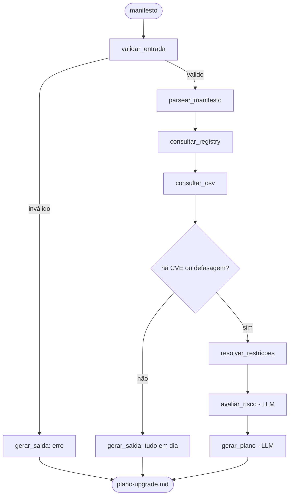

# Planejador de Upgrade de Dependências

Agente em **LangGraph** que lê um manifesto de dependências (`requirements.txt`, e futuramente `package.json`), cruza dados reais de registry e de vulnerabilidades, e devolve um **plano de upgrade priorizado em ondas** — não uma lista de versões, mas a ordem em que você abriria os PRs.

> Mini-Projeto Avaliativo — Módulo 2, disciplina *IA para Desenvolvedores [T1]*. Projeto individual.
> **Status atual do desenvolvimento está rastreado em [`ARQUITETURA.md`](ARQUITETURA.md), seção 1** — este README descreve o desenho completo do projeto; a seção referida diz exatamente o que já está implementado e o que falta.

---

## O problema

Manter dependências é sempre adiado até virar incidente. As ferramentas existentes respondem perguntas isoladas: `pip list --outdated` diz o que está velho, `pip-audit` diz o que é vulnerável. Nenhuma delas responde a pergunta que o desenvolvedor realmente tem:

> **"Por onde eu começo, o que dá pra subir sem quebrar nada, e o que vai me dar trabalho?"**

Isso não é consulta — é priorização sobre um grafo de restrições, com julgamento de risco. É onde um agente ganha de um comando.

## Objetivo do agente

| | |
|---|---|
| **Entrada** | Caminho de um `requirements.txt` (suporte a `package.json` planejado, ver limitações) |
| **Saída** | `saidas/plano-upgrade.md` — plano de upgrade em ondas, com cada afirmação rotulada pela fonte que a sustenta |
| **Processo** | Parsear o manifesto → consultar versões reais e CVEs → resolver conflitos de restrição entre as próprias dependências do manifesto → o LLM classifica risco e escreve o plano |

**Por que não é só "o Copilot já faz isso":** o LLM não sabe a versão atual de nenhum pacote — o conhecimento dele tem corte no tempo. Todo fato do plano vem de API real (PyPI, OSV.dev); o modelo só julga risco e escreve a narrativa. E resolver qual versão é compatível com qual não é geração de texto, é satisfação de restrições — o resolvedor do próprio `pip` é, na prática, um solver. Um LLM sozinho chuta isso; aqui, quem resolve é código determinístico, testado.

## Por que é um agente (não um script fixo)

O fluxo decide em tempo de execução, não segue sempre os mesmos passos:

- se o manifesto tiver uma linha malformada, ela vai para uma lista de erros e a execução segue — não derruba nada;
- se nenhuma dependência tiver CVE nem estiver desatualizada, o agente encerra sem gastar chamada de LLM;
- se houver conflito de versão entre duas dependências do próprio manifesto, entra o resolvedor antes de qualquer julgamento do modelo.

Essa tomada de decisão é modelada como aresta condicional no `StateGraph` (ver seção 6 do `ARQUITETURA.md`) — é o que diferencia um grafo de estados de um pipeline linear de funções.

---

## Ferramentas integradas (as ações reais do agente)

| Ferramenta | Arquivo | O que faz | Status |
|---|---|---|---|
| Parser de manifesto | `src/parsers.py` | `requirements.txt` → lista normalizada de dependências (nome, restrição), usando `packaging.requirements` | ✅ implementado e testado |
| Cliente PyPI | `src/registries.py` | Consulta `pypi.org/pypi/{pkg}/json` — versões reais publicadas, data de lançamento, `requires_dist` de cada versão | ✅ implementado e testado contra a API real |
| Cliente OSV.dev | `src/vulns.py` | `POST api.osv.dev/v1/query` — CVEs/GHSAs reais por pacote+versão (mesma query serve PyPI e npm) | ✅ implementado e testado contra a API real |
| Resolvedor de restrições | `src/resolver.py` | Núcleo determinístico: para cada dependência, calcula a maior versão viável e detecta se outra dependência do manifesto trava essa versão; se travar, testa se subir as duas juntas resolve | ✅ implementado, função pura, testada com fixture |
| Orquestração (`StateGraph`) | `src/agent.py` | Liga as ferramentas acima num grafo LangGraph com estado compartilhado e aresta condicional | ⏳ próxima etapa |
| CLI | `src/main.py` | `python -m src.main <manifesto>` → roda o grafo, escreve `saidas/plano-upgrade.md` | ⏳ próxima etapa |

Cada ferramenta acima tem um `if __name__ == "__main__":` com verificação própria (`assert`), rodável com `python -m src.<modulo>` — é assim que cada peça foi validada antes de existir o grafo que as liga.

## Fluxo com LangGraph (desenhado, implementação em andamento)



O estado (`EstadoUpgrade`, um `TypedDict`) carrega o manifesto parseado, as versões e CVEs consultadas, o resultado do resolvedor e a avaliação de risco por todos os nós — é o contexto/memória da execução. Detalhe completo em `ARQUITETURA.md`, seções 6 e 7.

## Segurança

- `GROQ_API_KEY` só via `.env` (nunca commitado — ver `.env.example` para o formato).
- Nome de pacote **nunca** interpolado cru numa URL: `registries.py` valida contra regex antes de montar a requisição.
- Timeout em toda chamada HTTP.
- O agente **lê e planeja, não executa upgrade** — não instala nada, não roda `pip`.

Detalhes em `ARQUITETURA.md`, seção 10.

---

## Como executar

### Hoje (ferramentas isoladas, sem LLM)

Cada ferramenta roda e se auto-verifica independente do agente:

```bash
python -m venv .venv
.venv/Scripts/activate       # Windows
pip install -r requirements.txt

python -m src.parsers        # parseia exemplos/requirements.txt
python -m src.registries     # consulta o PyPI de verdade (rede necessária)
python -m src.vulns          # consulta o OSV.dev de verdade (rede necessária)
python -m src.resolver       # resolve conflitos com dados fictícios (sem rede)
```

### Quando `src/agent.py` e `src/main.py` existirem

```bash
cp .env.example .env         # preencha GROQ_API_KEY
python -m src.main exemplos/requirements.txt
```

Isso vai gerar `saidas/plano-upgrade.md`.

## Exemplo de entrada

[`exemplos/requirements.txt`](exemplos/requirements.txt) — um manifesto deliberadamente desatualizado, com um conflito real de propósito:

```
fastapi==0.85.0
pydantic==1.10.2          # fastapi 0.85 exige pydantic<2: upgrade de pydantic arrasta fastapi
requests==2.28.1           # tem CVE conhecido (GHSA-9hjg-9r4m-mvj7)
urllib3>=1.21.1,<1.27
python-dotenv~=0.21
uvicorn[standard]==0.19.0

!!! isto não é uma linha de dependência válida !!!

boto3==1.29.0
botocore==1.29.0
```

A linha inválida está lá de propósito, para mostrar que o parser não quebra com entrada malformada — ela vai para a lista de erros e o resto do manifesto continua sendo processado.

## Exemplo de saída

**Ainda não existe** — depende de `src/agent.py`, que é a próxima etapa do desenvolvimento. Quando existir, este README será atualizado com a saída real gerada a partir do `exemplos/requirements.txt` acima (não um exemplo fabricado à mão).

O **formato** planejado para essa saída — com a etiqueta de procedência (`[PyPI]`, `[OSV]`, `[LLM]`) em cada linha, para que todo fato seja rastreável e só o julgamento venha do modelo — está documentado em `ARQUITETURA.md`, seção 9.

---

## Principais decisões tomadas

- **Groq como provedor de LLM**, via `langchain-groq`.
- **Resolvedor como função pura, sem rede**: `resolver.py` não chama API nenhuma — recebe dados já buscados por `registries.py`. Isso tornou possível testar o núcleo do agente com fixtures determinísticas, sem depender de rede nem de mock.
- **Um cliente HTTP por fonte de dado** (`registries.py`, `vulns.py`), cada um com seu próprio `if __name__ == "__main__":` de verificação contra a API real — cada peça foi validada isoladamente antes de existir orquestração.
- **Etiqueta de procedência na saída**: toda afirmação do plano final será marcada com a fonte (`[PyPI]`, `[OSV]`, `[LLM]`), para que o plano seja auditável linha a linha, não uma caixa preta.
- Decisões completas, incluindo as descartadas (ex.: "menor conjunto de upgrades que zera CVEs" foi rejeitada por degenerar em recomendação trivial), estão registradas em `docs/prompts.md`.

## Limitações da solução

- **Só o manifesto, não o código.** O agente julga risco por salto de versão e `requires_dist`; não lê o código do projeto para confirmar o que vai quebrar de fato.
- **Só dependências diretas** declaradas no manifesto — não resolve a árvore transitiva inteira.
- **Comparação atual → última disponível**, não uma varredura de todo o espaço de versões intermediárias como um solver SAT completo faria.
- **`package.json`/npm ainda não implementado.** `parsers.detectar_ecossistema` já reconhece o arquivo, mas `parse_manifesto` levanta `NotImplementedError` para ele — é a próxima etapa depois do grafo. Quando existir, a assimetria estrutural entre pip (flat, conflito real existe) e npm (aninhado em `node_modules`, conflito raro fora de `peerDependencies`) será declarada explicitamente, não escondida.
- **Ferramentas como `pip-audit`/`pip list --outdated` já existem** e cobrem partes deste escopo. O diferencial proposto aqui é cruzar as fontes e produzir um plano agrupado e priorizado com julgamento de risco — não reivindicar ineditismo em cada peça isolada.
- **A narrativa de risco vem do LLM** e pode variar entre execuções; os fatos (versão, CVE, restrição) não variam, pois vêm sempre da API.

## Estrutura do repositório

```
ARQUITETURA.md        # arquitetura completa + checklist vivo de progresso
README.md             # este arquivo
requirements.txt
.env.example
src/
  parsers.py           # parser de requirements.txt
  registries.py         # cliente PyPI
  vulns.py               # cliente OSV.dev
  resolver.py             # nucleo de restricoes (funcao pura)
docs/
  prompts.md            # prompts usados no desenvolvimento
exemplos/
  requirements.txt      # manifesto de exemplo, com conflito real
```

## Documentação relacionada

- [`ARQUITETURA.md`](ARQUITETURA.md) — arquitetura completa, rastreio de critérios de avaliação, checklist de progresso, cronograma.
- [`docs/prompts.md`](docs/prompts.md) — prompts usados para planejar e desenvolver o agente.
