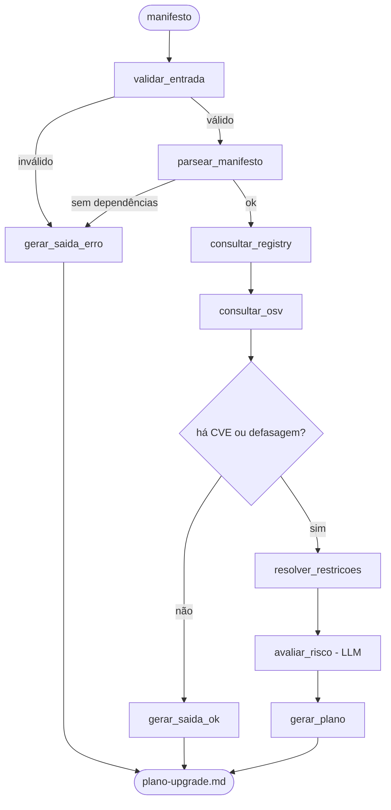

# Planejador de Upgrade de Dependências

Agente em **LangGraph** que lê um manifesto de dependências (`requirements.txt` ou `package.json`), cruza dados reais de registry e de vulnerabilidades, e devolve um **plano de upgrade priorizado em ondas** — não uma lista de versões, mas a ordem em que você abriria os PRs.

> Mini-Projeto Avaliativo — Módulo 2, disciplina *IA para Desenvolvedores [T1]*. Projeto individual.
> **Status atual do desenvolvimento está rastreado em [`ARQUITETURA.md`](ARQUITETURA.md), seção 1** — este README descreve o desenho completo do projeto; a seção referida diz exatamente o que já está implementado e o que falta.

---

## O problema

Manter dependências é sempre adiado até virar incidente. As ferramentas existentes respondem perguntas isoladas: `pip list --outdated` diz o que está velho, `pip-audit` diz o que é vulnerável. Nenhuma delas responde a pergunta que o desenvolvedor realmente tem:

> **"Por onde eu começo, o que dá pra subir sem quebrar nada, e o que vai me dar trabalho?"**

Isso não é consulta — é priorização sobre um grafo de restrições, com julgamento de risco. É onde um agente ganha de um comando.

## Objetivo do agente

| | |
|---|---|
| **Entrada** | Caminho de um `requirements.txt` ou `package.json` — ecossistema detectado pelo nome do arquivo |
| **Saída** | `saidas/plano-upgrade.md` — plano de upgrade em ondas, com cada afirmação rotulada pela fonte que a sustenta |
| **Processo** | Parsear o manifesto → consultar versões reais e CVEs → resolver conflitos de restrição entre as próprias dependências do manifesto → o LLM classifica risco e escreve o plano |

**Por que não é só "o Copilot já faz isso":** o LLM não sabe a versão atual de nenhum pacote — o conhecimento dele tem corte no tempo. Todo fato do plano vem de API real (PyPI, OSV.dev); o modelo só julga risco e escreve a narrativa. E resolver qual versão é compatível com qual não é geração de texto, é satisfação de restrições — o resolvedor do próprio `pip` é, na prática, um solver. Um LLM sozinho chuta isso; aqui, quem resolve é código determinístico, testado.

## Por que é um agente (não um script fixo)

O fluxo decide em tempo de execução, não segue sempre os mesmos passos:

- se o manifesto tiver uma linha malformada, ela vai para uma lista de erros e a execução segue — não derruba nada;
- se nenhuma dependência tiver CVE nem estiver desatualizada, o agente encerra sem gastar chamada de LLM;
- se houver conflito de versão entre duas dependências do próprio manifesto, entra o resolvedor antes de qualquer julgamento do modelo.

Essa tomada de decisão é modelada como aresta condicional no `StateGraph` (ver seção 6 do `ARQUITETURA.md`) — é o que diferencia um grafo de estados de um pipeline linear de funções.

---

## Ferramentas integradas (as ações reais do agente)

| Ferramenta | Arquivo | O que faz | Status |
|---|---|---|---|
| Parser de manifesto | `src/parsers.py` | `requirements.txt` (via `packaging.requirements`) e `package.json` (`dependencies`+`devDependencies`) → lista normalizada de dependências | ✅ implementado e testado, os dois ecossistemas |
| Cliente PyPI | `src/registries.py` | Consulta `pypi.org/pypi/{pkg}/json` — versões reais publicadas, data de lançamento, `requires_dist` de cada versão | ✅ implementado e testado contra a API real |
| Cliente npm | `src/registries.py` | Consulta `registry.npmjs.org/{pkg}` — versões reais, tag `latest`, com matcher de range semver (`^`, `~`, exata, comparadores) | ✅ implementado e testado contra a API real |
| Cliente OSV.dev | `src/vulns.py` | `POST api.osv.dev/v1/query` — CVEs/GHSAs reais por pacote+versão (mesma query serve PyPI e npm) | ✅ implementado e testado contra a API real |
| Resolvedor de restrições | `src/resolver.py` | Núcleo determinístico: para cada dependência, calcula a maior versão viável e detecta se outra dependência do manifesto trava essa versão; se travar, testa se subir as duas juntas resolve | ✅ implementado, função pura, testada com fixture. **Só PyPI** alimenta o agrupamento "sobe junto" — ver limitações |
| Orquestração (`StateGraph`) | `src/agent.py` | Liga as ferramentas acima num grafo LangGraph com estado compartilhado e duas arestas condicionais | ✅ implementado, rodado ponta a ponta contra PyPI + OSV.dev reais |
| Avaliação de risco | `src/prompts.py` | Prompt isolado do fluxo; LLM (Groq) só classifica risco, nunca escreve fato — sem `GROQ_API_KEY` cai num fallback "não avaliado" em vez de quebrar | ✅ implementado e testado com `GROQ_API_KEY` real |
| CLI | `src/main.py` | `python -m src.main <manifesto>` → roda o grafo, escreve `saidas/plano-upgrade.md` | ✅ implementado e testado |

Cada ferramenta tem seu próprio self-check (`if __name__ == "__main__":`) — é assim que cada peça foi validada antes de existir o grafo que as liga (comandos na seção "Como executar" abaixo).

## Fluxo com LangGraph (implementado)



Duas arestas condicionais, não uma: além de "há CVE ou defasagem?", `validar_entrada` **e** `parsear_manifesto` podem encerrar cedo em erro (arquivo inexistente, vazio, ou sem nenhuma dependência reconhecível) — sem gastar consulta de rede nem chamada de LLM à toa.

`gerar_plano` **não** chama o LLM de novo. É um template determinístico em Python que monta o markdown a partir do estado — só a linha `Risco:` de cada item vem do `avaliar_risco`. Foi uma escolha deliberada: deixar o LLM reescrever o plano inteiro arriscaria alucinar um fato que já estava correto no estado. Ver `docs/prompts.md` para a decisão completa.

O estado (`EstadoUpgrade`, um `TypedDict`) carrega o manifesto parseado, as versões e CVEs consultadas, o resultado do resolvedor e a avaliação de risco por todos os nós — é o contexto/memória da execução. Detalhe completo em `ARQUITETURA.md`, seções 6 e 7.

## Segurança

- `GROQ_API_KEY` só via `.env` (nunca commitado — ver `.env.example` para o formato).
- Nome de pacote **nunca** interpolado cru numa URL: `registries.py` valida contra regex antes de montar a requisição.
- Timeout em toda chamada HTTP.
- O agente **lê e planeja, não executa upgrade** — não instala nada, não roda `pip`.

Detalhes em `ARQUITETURA.md`, seção 10.

---

## Como executar

### 1. Instalar

```bash
python -m venv .venv
.venv/Scripts/activate        # Windows — no Linux/Mac: source .venv/bin/activate
pip install -r requirements.txt
cp .env.example .env          # preencha GROQ_API_KEY (opcional — sem ela, "Risco" fica "não avaliado")
```

Chave gratuita em [console.groq.com/keys](https://console.groq.com/keys).

### 2. Rodar o agente

```bash
python -m src.main exemplos/requirements.txt   # ecossistema PyPI
python -m src.main exemplos/package.json       # ecossistema npm
```

Gera `saidas/plano-upgrade.md` e imprime o plano no terminal. **`python -m src.main`, não `python src/main.py`** — o pacote usa imports relativos (`from .agent import executar`), que só resolvem quando o módulo é invocado com `-m`.

### 3. Rodar os testes

```bash
python -m unittest discover -s tests -v
```

`tests/test_agent.py` cobre manifesto vazio, linha malformada, pacote inexistente (404 real contra o PyPI) e o conflito fastapi/pydantic resolvendo em grupo. Só o teste de 404 usa rede — se ela cair, o teste avisa e pula, não falha em silêncio.

### 4. Rodar uma ferramenta isolada (opcional, para depurar)

Cada módulo em `src/` tem seu próprio self-check, útil para testar uma peça sem subir o grafo inteiro:

```bash
python -m src.parsers        # parseia exemplos/requirements.txt e exemplos/package.json
python -m src.registries     # consulta PyPI e npm de verdade (rede necessária)
python -m src.vulns          # consulta o OSV.dev de verdade (rede necessária)
python -m src.resolver       # resolve conflitos com fixture fictícia (sem rede)
```

## Exemplo de entrada

[`exemplos/requirements.txt`](exemplos/requirements.txt) — um manifesto deliberadamente desatualizado, com um conflito real de propósito:

```
fastapi==0.85.0
pydantic==1.10.2          # fastapi 0.85 exige pydantic<2: upgrade de pydantic arrasta fastapi
requests==2.28.1           # tem CVE conhecido (GHSA-9hjg-9r4m-mvj7)
urllib3>=1.21.1,<1.27
python-dotenv~=0.21
uvicorn[standard]==0.19.0

!!! isto não é uma linha de dependência válida !!!

boto3==1.29.0
botocore==1.29.0
```

A linha inválida está lá de propósito, para mostrar que o parser não quebra com entrada malformada — ela vai para a lista de erros e o resto do manifesto continua sendo processado.

Equivalente npm: [`exemplos/package.json`](exemplos/package.json) — `express`, `lodash`, `axios`, `body-parser` (todos com CVE conhecido em versões antigas) e `nodemon` como dev dependency, misturando pin exato, `^` e `~`.

## Exemplo de saída

[`exemplos/plano-upgrade.md`](exemplos/plano-upgrade.md) — gerado de verdade a partir do `exemplos/requirements.txt` acima, rodando contra PyPI, OSV.dev e Groq (`GROQ_API_KEY` real) reais:

```markdown
# Plano de Upgrade — requirements.txt (PyPI)
> 8 dependências diretas · 5 vulnerável(is) · 4 com upgrade sugerido · 0 bloqueada(s)

## Onda 1 — Urgente

### boto3 1.29.0 → 1.43.51   [minor]
Move junto:  boto3==1.29.0 exige botocore<1.33.0,>=1.32.0; botocore==1.29.0 exige urllib3<1.27,>=1.25.4; requests==2.28.1 exige urllib3<1.27,>=1.21.1  [PyPI]
Risco:       O upgrade é de versão minor e não há motivos aparentes para quebrar o projeto.  [LLM]
...
### fastapi 0.85.0 → 0.139.2   [minor]
Por quê:     PYSEC-2024-38 — FastAPI is a web framework for building APIs...  [OSV]
Move junto:  fastapi==0.85.0 exige pydantic!=1.7,...,<2.0.0,>=1.6.2  [PyPI]
Risco:       O upgrade é de versão minor e não há motivos aparentes para quebrar o projeto.  [LLM]
### pydantic 1.10.2 → 2.13.4   [major]
Por quê:     GHSA-mr82-8j83-vxmv, PYSEC-2026-1812 — Pydantic regular expression denial of service  [OSV]
Move junto:  fastapi==0.85.0 exige pydantic!=1.7,...,<2.0.0,>=1.6.2  [PyPI]
Risco:       O upgrade é de versão major e pode quebrar o projeto devido às mudanças significativas.  [LLM]
...
## Onda 2 — Seguro (sem CVE, salto pequeno)

### uvicorn 0.19.0 → 0.51.0   [minor]
Risco:       O upgrade é de versão minor e não há motivos aparentes para quebrar o projeto.  [LLM]
```

Arquivo completo (37 linhas) em [`exemplos/plano-upgrade.md`](exemplos/plano-upgrade.md). A linha `Risco:` varia com o salto de versão (`minor` → sem motivo aparente; `major` → "pode quebrar... mudanças significativas") — é julgamento real do modelo, não um texto fixo.

`fastapi` e `pydantic` aparecem no **mesmo grupo**, com "Move junto" explicando por quê — é o resolvedor detectando que `fastapi==0.85.0` trava `pydantic<2.0.0`, e verificando que a versão mais recente do fastapi já libera pydantic 2.x, então as duas sobem juntas. `boto3`/`botocore`/`urllib3`/`requests` viraram um único grupo maior pelo mesmo motivo, encadeado (cada um trava o próximo). Nenhum desses agrupamentos foi programado à mão — saiu do cruzamento real de `requires_dist` de cada pacote.

A etiqueta de procedência (`[PyPI]`, `[OSV]`, `[LLM]`) em cada linha está documentada em `ARQUITETURA.md`, seção 9.

O equivalente para npm — [`exemplos/plano-upgrade-npm.md`](exemplos/plano-upgrade-npm.md), gerado a partir de `exemplos/package.json` — não tem nenhum "Move junto": é a assimetria pip×npm na prática (ver Limitações abaixo), não um bug.

---

## Principais decisões tomadas

- **Groq como provedor de LLM**, via `langchain-groq`.
- **Resolvedor como função pura, sem rede**: `resolver.py` não chama API nenhuma — recebe dados já buscados por `registries.py`. Isso tornou possível testar o núcleo do agente com fixtures determinísticas, sem depender de rede nem de mock.
- **Um cliente HTTP por fonte de dado** (`registries.py`, `vulns.py`) — cada peça foi validada isoladamente contra a API real antes de existir orquestração.
- **Etiqueta de procedência na saída**: toda afirmação do plano final é marcada com a fonte (`[PyPI]`, `[OSV]`, `[LLM]`), para que o plano seja auditável linha a linha, não uma caixa preta.
- **`gerar_plano` não chama o LLM** — é template determinístico em Python; só a linha `Risco:` vem do modelo. Um segundo LLM call reescrevendo o plano inteiro arriscaria alucinar um fato que o estado já tinha correto.
- **Versão "efetiva" calculada a partir da restrição do manifesto**, não só de pin exato (`==`). `>=1.21.1,<1.27` também gera sugestão de upgrade — a versão comparada é a maior que já satisfaz essa faixa hoje, que é o que o `pip install`/`npm install` de fato resolveria.
- **Pré-release nunca é "a maior versão disponível"**: descoberto rodando contra a API real do PyPI — sem esse filtro, `pydantic` apareceu como `2.14.0a1` (alpha) e travou um grupo que deveria ter resolvido.
- Decisões completas, incluindo as descartadas (ex.: "menor conjunto de upgrades que zera CVEs" foi rejeitada por degenerar em recomendação trivial), estão registradas em `docs/prompts.md`.

## Limitações da solução

- **Só o manifesto, não o código.** O agente julga risco por salto de versão e `requires_dist`; não lê o código do projeto para confirmar o que vai quebrar de fato.
- **Só dependências diretas** declaradas no manifesto — não resolve a árvore transitiva inteira.
- **Comparação atual → última disponível**, não uma varredura de todo o espaço de versões intermediárias como um solver SAT completo faria.
- **npm não participa do agrupamento "sobe junto".** `requires_dist` do npm vem como `"nome@range"`, formato que o parser PEP 508 do resolvedor não entende — decisão deliberada (ver seção "Ferramentas" acima), não bug. npm ainda ganha consulta real de versão e CVE, só fica sem checagem de conflito cruzado entre as próprias dependências do manifesto (que, por sinal, é rara fora de `peerDependencies`, que também não está neste escopo).
- **Range de versão do npm cobre só o subconjunto comum**: exata, `^`, `~`, comparadores simples. `||` e ranges hifenizados (`"1.2.3 - 2.3.4"`) não são avaliados — o agente cai para a tag `latest` do pacote em vez de arriscar interpretar errado.
- **Ferramentas como `pip-audit`/`pip list --outdated` já existem** e cobrem partes deste escopo. O diferencial proposto aqui é cruzar as fontes e produzir um plano agrupado e priorizado com julgamento de risco — não reivindicar ineditismo em cada peça isolada.
- **A narrativa de risco vem do LLM** e pode variar entre execuções; os fatos (versão, CVE, restrição) não variam, pois vêm sempre da API.

## Estrutura do repositório

```
ARQUITETURA.md        # arquitetura completa + checklist vivo de progresso
README.md             # este arquivo
requirements.txt
.env.example
src/
  parsers.py           # parser de requirements.txt e package.json
  registries.py        # clientes PyPI e npm
  vulns.py              # cliente OSV.dev
  resolver.py            # nucleo de restricoes (funcao pura, so PyPI)
  prompts.py              # prompt do LLM, isolado do fluxo
  agent.py                 # StateGraph: liga tudo, com aresta condicional
  main.py                   # CLI
docs/
  prompts.md            # prompts usados no desenvolvimento
  slides.md              # apresentacao da ideia (2 slides)
exemplos/
  requirements.txt      # manifesto PyPI, com conflito real
  package.json           # manifesto npm
  plano-upgrade.md      # saida real (PyPI)
  plano-upgrade-npm.md   # saida real (npm)
tests/
  test_agent.py         # manifesto vazio, malformado, 404, conflito real
```

## Documentação relacionada

- [`ARQUITETURA.md`](ARQUITETURA.md) — arquitetura completa, rastreio de critérios de avaliação, checklist de progresso, cronograma.
- [`docs/prompts.md`](docs/prompts.md) — prompts usados para planejar e desenvolver o agente.
- [`docs/slides.md`](docs/slides.md) — apresentação da ideia do projeto (2 slides).
